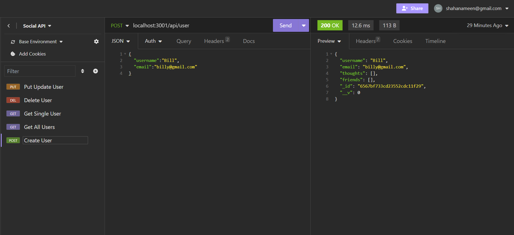

## NoSQL-Network

## description
In this assignment I've demonstrated in the connection between the connections.js, controllers.js, models, and routes in order for the backend to communicate to each other. In order to know they were connected properly to each other I had to run npm start in order for the local host:3001. Local host allows us to test the users, and thoughts from put, delete, get, and posts. In this assignment we learned how critical the param id applies to insomina as well.

## application img'

## URL
https://github.com/ShahanAmeen/Employee-portfolio
 
https://shahanameen.github.io/Employee-portfolio/
## Author
Shahan Ameen
https://github.com/ShahanAmeen 

